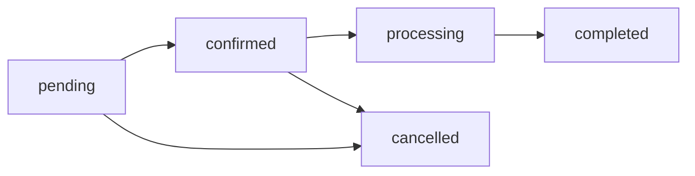

# 📦 Módulo de Pedidos - ShowRoom

## 🎯 Descripción General

El módulo de pedidos permite la gestión completa del flujo de pedidos en la aplicación ShowRoom, desde la creación por parte de los clientes hasta la administración por parte de los admins, con funcionalidades de descarga en PDF y exportación a Excel.

## 🗄️ Estructura de Base de Datos

### Tabla: `orders`
```sql
- id: UUID (Primary Key)
- user_id: UUID (Foreign Key → users.id)
- brand_name: TEXT (Nombre de la marca)
- status: ENUM ('pending', 'confirmed', 'processing', 'completed', 'cancelled')
- total_items: INTEGER (Total de artículos)
- total_amount: DECIMAL(10,2) (Monto total)
- notes: TEXT (Notas adicionales)
- created_at: TIMESTAMP
- updated_at: TIMESTAMP
- processed_by: UUID (Usuario que procesó el pedido)
- processed_at: TIMESTAMP
```

### Tabla: `order_items`
```sql
- id: UUID (Primary Key)
- order_id: UUID (Foreign Key → orders.id)
- product_id: UUID (Foreign Key → products.id)
- product_sku: TEXT
- product_name: TEXT
- product_image: TEXT
- price: DECIMAL(10,2)
- size_name: TEXT
- quantity: INTEGER
- subtotal: DECIMAL(10,2)
- created_at: TIMESTAMP
```

## 🔐 Políticas de Seguridad (RLS)

### Para `orders`:
- **Superadmins**: Acceso total a todos los pedidos
- **Admins**: Solo pedidos de sus marcas asignadas
- **Clientes**: Solo sus propios pedidos

### Para `order_items`:
- **Superadmins**: Acceso total a todos los items
- **Admins**: Solo items de pedidos de sus marcas
- **Clientes**: Solo items de sus propios pedidos

## 🚀 Funcionalidades Implementadas

### 👤 Para Clientes (`/my-orders`)
- ✅ **Visualización** de historial de pedidos personal
- ✅ **Filtrado** por estado del pedido
- ✅ **Descarga de PDF** individual por pedido
- ✅ **Vista detallada** de cada pedido con todos los productos
- ✅ **Estados visuales** con badges de colores

### 👨‍💼 Para Admins (`/orders`)
- ✅ **Gestión de pedidos** de sus marcas asignadas
- ✅ **Actualización de estados** de pedidos
- ✅ **Búsqueda** por cliente o ID de pedido
- ✅ **Filtrado** por estado
- ✅ **Descarga de PDF** individual
- ✅ **Exportación masiva** a Excel
- ✅ **Vista detallada** completa

### 🔧 Para Superadmins
- ✅ **Acceso total** a todos los pedidos de todas las marcas
- ✅ **Todas las funcionalidades** de admin
- ✅ **Gestión completa** del sistema

## 📱 Integración con el Carrito

### Flujo de Creación de Pedidos
1. **Cliente añade productos** al carrito desde el catálogo
2. **Edita cantidades** por talla según necesidad
3. **Confirma el pedido** desde la página del carrito
4. **Sistema guarda** automáticamente:
   - Datos del pedido en tabla `orders`
   - Items individuales en tabla `order_items`
5. **Genera PDF** automáticamente para el cliente
6. **Limpia el carrito** local

### Código de Ejemplo - Creación de Pedido
```typescript
const proceedToCheckout = async () => {
  // 1. Guardar pedido principal
  const orderData = {
    user_id: user?.id,
    brand_name: selectedBrand?.name,
    total_items: getTotalItems(),
    total_amount: getTotalPrice(),
    status: 'pending' as const,
  };

  const { data: order } = await supabase
    .from('orders')
    .insert(orderData)
    .select()
    .single();

  // 2. Guardar items del pedido
  const orderItems = cartItems.flatMap(item => 
    item.sizes?.map(size => ({
      order_id: order.id,
      product_id: item.productId,
      product_sku: item.productSku,
      product_name: item.productName,
      price: item.price,
      size_name: size.name,
      quantity: size.quantity,
      subtotal: item.price * size.quantity,
    })) || []
  );

  await supabase.from('order_items').insert(orderItems);
};
```

## 📄 Generación de PDFs

### Características del PDF
- **Encabezado** con información del pedido
- **Datos del cliente** y marca
- **Tabla detallada** de productos por talla
- **Totales** de cantidad y monto
- **Diseño minimalista** y profesional
- **Nombre automático** con ID y fecha

### Librerías Utilizadas
- `jspdf`: Generación de PDFs
- `jspdf-autotable`: Tablas automáticas

## 📊 Exportación a Excel

### Funcionalidades
- **Exportación masiva** de todos los pedidos visibles
- **Filtros aplicados** se respetan en la exportación
- **Columnas incluidas**:
  - ID Pedido
  - Fecha
  - Cliente (nombre y email)
  - Marca
  - Estado
  - Total Artículos
  - Total Monto
  - Notas

### Librería Utilizada
- `xlsx`: Generación de archivos Excel

## 🎨 Componentes de UI

### Estados de Pedidos con Badges
```typescript
const getStatusBadgeVariant = (status: OrderStatus) => {
  switch (status) {
    case 'pending': return 'outline';      // Gris - Pendiente
    case 'confirmed': return 'default';    // Azul - Confirmado
    case 'processing': return 'secondary'; // Verde - Procesando
    case 'completed': return 'default';    // Azul - Completado
    case 'cancelled': return 'destructive';// Rojo - Cancelado
  }
};
```

### Filtros y Búsqueda
- **Búsqueda en tiempo real** con debounce (300ms)
- **Filtros por estado** del pedido
- **Resultados dinámicos** sin recarga de página

## 🔄 Estados del Pedido

### Flujo de Estados


### Descripciones
- **pending**: Pedido recién creado, esperando confirmación
- **confirmed**: Pedido confirmado por el admin
- **processing**: Pedido en proceso de preparación
- **completed**: Pedido completado y entregado
- **cancelled**: Pedido cancelado

## 📁 Archivos Creados/Modificados

### Nuevos Archivos
- `sql/create-orders-table.sql` - Script de creación de tablas
- `src/pages/orders.tsx` - Página de gestión para admins
- `src/pages/my-orders.tsx` - Página de historial para clientes
- `ORDERS_MODULE_README.md` - Esta documentación

### Archivos Modificados
- `src/integrations/supabase/types.ts` - Tipos de orders y order_items
- `src/types/index.ts` - Tipos de Order, OrderItem, OrderWithDetails
- `src/pages/cart.tsx` - Integración con guardado de pedidos
- `src/App.tsx` - Nuevas rutas para orders y my-orders
- `src/components/layout.tsx` - Menús diferenciados por rol
- `package.json` - Nueva dependencia: xlsx

## 🚀 Instalación y Configuración

### 1. Ejecutar Script SQL
```sql
-- Ejecutar en la consola SQL de Supabase
\i sql/create-orders-table.sql
```

### 2. Instalar Dependencias
```bash
npm install xlsx @types/xlsx
```

### 3. Verificar Tipos
```bash
npm run build
```

## 🔮 Próximas Mejoras

### Funcionalidades Futuras
- [ ] **Notificaciones push** cuando cambie el estado
- [ ] **Chat/comentarios** por pedido
- [ ] **Tracking de envío** integrado
- [ ] **Reportes avanzados** con gráficos
- [ ] **Exportación por rangos** de fecha
- [ ] **Pedidos recurrentes** para clientes frecuentes
- [ ] **Integración con WhatsApp** para notificaciones

### Optimizaciones Técnicas
- [ ] **Paginación** para listas de pedidos largas
- [ ] **Scroll virtual** para +1000 pedidos
- [ ] **Caché inteligente** de pedidos frecuentes
- [ ] **Compresión** de PDFs grandes
- [ ] **Preview** de PDF antes de descargar

## 📞 Soporte

Para consultas sobre este módulo, contactar al equipo de desarrollo o revisar la documentación técnica en el repositorio. 